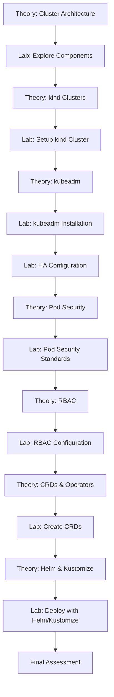
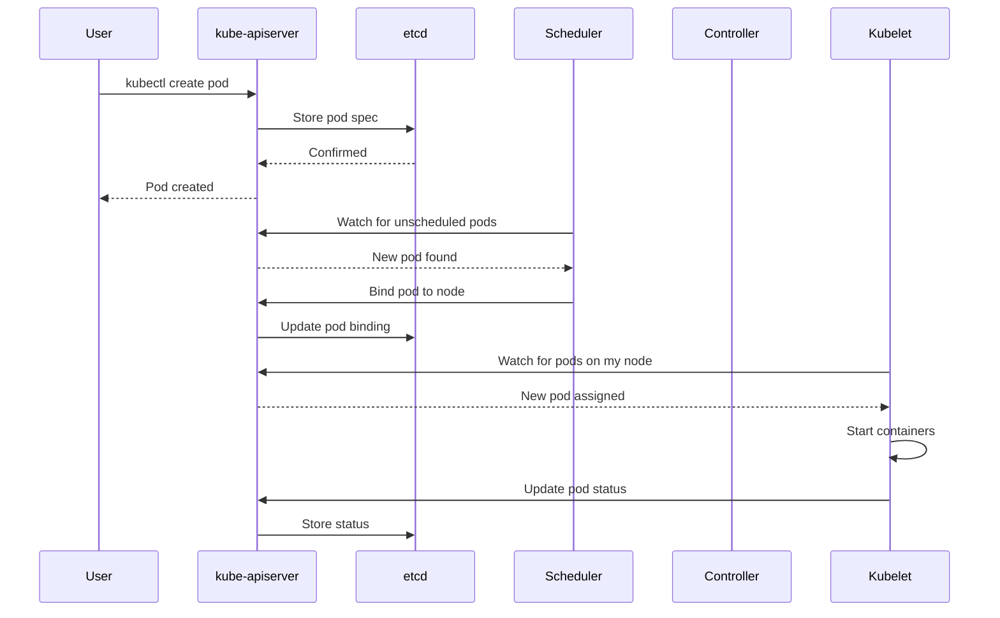
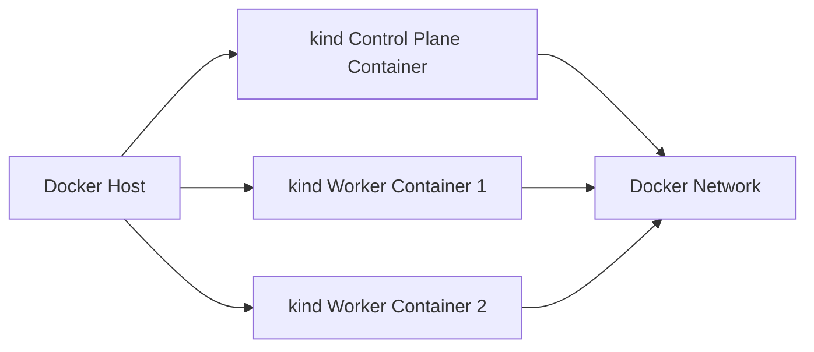
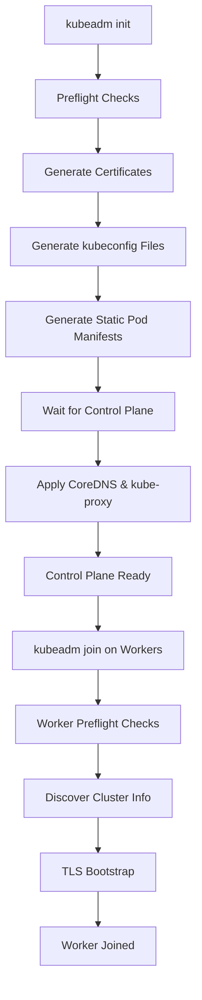
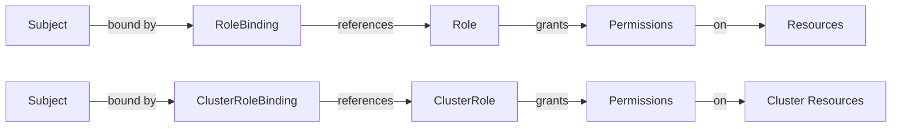

# Design Document: CKA Module 1 - Cluster Architecture, Installation & Configuration

## Overview

This design outlines a comprehensive learning system for Kubernetes CKA Module 1, covering Cluster Architecture, Installation & Configuration. The system will provide structured theory documentation, hands-on lab exercises, configuration examples, and troubleshooting guides. The implementation will use Markdown for documentation, YAML for Kubernetes configurations, and shell scripts for automation where appropriate.

The learning system is designed to be self-contained, allowing candidates to progress from foundational concepts through advanced topics with practical exercises that mirror real CKA exam scenarios.

## Architecture

### System Structure

```
cka-module1-cluster-architecture/
├── theory/
│   ├── 01-cluster-architecture.md
│   ├── 02-kind-clusters.md
│   ├── 03-kubeadm-setup.md
│   ├── 04-pod-security.md
│   ├── 05-rbac.md
│   ├── 06-crds-operators.md
│   └── 07-helm-kustomize.md
├── labs/
│   ├── lab01-cluster-components/
│   ├── lab02-kind-setup/
│   ├── lab03-kubeadm-cluster/
│   ├── lab04-ha-configuration/
│   ├── lab05-pod-security/
│   ├── lab06-rbac-configuration/
│   ├── lab07-crds/
│   └── lab08-helm-kustomize/
├── configs/
│   ├── kind/
│   ├── kubeadm/
│   ├── rbac/
│   ├── pod-security/
│   └── crds/
├── scripts/
│   ├── setup-kind.sh
│   ├── setup-kubeadm.sh
│   ├── backup-etcd.sh
│   └── verify-labs.sh
└── diagrams/
    ├── cluster-architecture.mmd
    ├── control-plane-flow.mmd
    └── ha-setup.mmd
```

### Learning Flow



## Components and Interfaces

### Theory Documentation Components

Each theory document will follow this structure:
- **Overview**: High-level introduction to the topic
- **Core Concepts**: Detailed explanations with examples
- **Architecture Diagrams**: Visual representations using Mermaid
- **Best Practices**: Production-ready recommendations
- **Common Pitfalls**: Mistakes to avoid
- **Exam Tips**: CKA-specific guidance
- **References**: Links to official Kubernetes documentation

### Lab Exercise Components

Each lab will include:
- **Objective**: Clear learning goal
- **Prerequisites**: Required knowledge and tools
- **Step-by-Step Instructions**: Detailed commands with explanations
- **Expected Output**: What success looks like
- **Verification Steps**: Commands to validate completion
- **Troubleshooting**: Common issues and solutions
- **Cleanup**: Steps to reset environment

### Configuration Files

All YAML configurations will:
- Include inline comments explaining each field
- Follow Kubernetes best practices
- Be version-controlled and tested
- Include both basic and advanced examples

## Data Models

### Theory Document Structure

```yaml
theory_document:
  title: string
  topic: string
  difficulty: enum[beginner, intermediate, advanced]
  estimated_time: string
  sections:
    - overview: string
    - concepts: array[concept]
    - diagrams: array[diagram]
    - best_practices: array[practice]
    - exam_tips: array[tip]
    - references: array[url]
```

### Lab Exercise Structure

```yaml
lab_exercise:
  id: string
  title: string
  objective: string
  difficulty: enum[beginner, intermediate, advanced]
  estimated_time: string
  prerequisites: array[string]
  steps: array[step]
  verification: array[command]
  cleanup: array[command]
  troubleshooting: array[issue]
```

### Configuration Template Structure

```yaml
config_template:
  name: string
  type: enum[kind, kubeadm, rbac, pod-security, crd, helm, kustomize]
  description: string
  yaml_content: string
  usage_instructions: string
  parameters: array[parameter]
```

## Detailed Theory Content Design

### 1. Cluster Architecture Theory

**Control Plane Components:**

- **kube-apiserver**: 
  - REST API frontend for Kubernetes
  - Validates and processes API requests
  - Only component that talks to etcd
  - Horizontally scalable
  
- **etcd**:
  - Distributed key-value store
  - Stores all cluster data
  - Requires regular backups
  - Uses Raft consensus algorithm
  
- **kube-scheduler**:
  - Watches for newly created Pods
  - Selects nodes based on resource requirements, constraints, affinity rules
  - Does not actually place pods (kubelet does)
  
- **kube-controller-manager**:
  - Runs controller processes
  - Node controller, Replication controller, Endpoints controller, ServiceAccount controller
  - Each controller is a separate process compiled into single binary
  
- **cloud-controller-manager** (optional):
  - Integrates with cloud provider APIs
  - Node, Route, and Service controllers for cloud resources

**Worker Node Components:**

- **kubelet**:
  - Agent running on each node
  - Ensures containers are running in Pods
  - Registers node with API server
  - Reports node and pod status
  
- **kube-proxy**:
  - Network proxy on each node
  - Maintains network rules for pod communication
  - Implements Service abstraction
  - Uses iptables or IPVS
  
- **Container Runtime**:
  - Software responsible for running containers
  - Must implement CRI (Container Runtime Interface)
  - Examples: containerd, CRI-O, Docker Engine (via cri-dockerd)

**Component Communication Flow:**



### 2. kind Clusters Theory

**What is kind:**
- Kubernetes IN Docker
- Runs Kubernetes clusters using Docker containers as nodes
- Designed for testing Kubernetes itself
- Excellent for local development and CI/CD

**kind v1.34 Advanced Features:**
- Multi-node clusters (multiple control plane and worker nodes)
- Custom networking configurations
- Ingress controller support
- Local registry integration
- Custom node images
- Port mapping for services
- Volume mounts from host

**kind Architecture:**



### 3. kubeadm Setup Theory

**kubeadm Workflow:**



**Cluster Lifecycle Operations:**
- **Upgrade**: Rolling upgrade of control plane then workers
- **Backup**: etcd snapshot, certificates, configuration files
- **Restore**: Restore etcd from snapshot, reconfigure cluster
- **Scale**: Add/remove worker nodes, add control plane nodes for HA

**HA Configuration:**
- Multiple control plane nodes (typically 3 or 5)
- Load balancer in front of API servers
- Stacked etcd (on control plane nodes) or external etcd cluster
- Requires shared storage for some components

### 4. Pod Security Theory

**Pod Security Standards:**

1. **Privileged**: Unrestricted, allows known privilege escalations
2. **Baseline**: Minimally restrictive, prevents known privilege escalations
3. **Restricted**: Heavily restricted, follows pod hardening best practices

**Pod Security Admission:**
- Namespace-level enforcement
- Three modes: enforce, audit, warn
- Can set different standards for different modes
- Replaces deprecated PodSecurityPolicy

**Common Restrictions:**
- Host namespaces (hostNetwork, hostPID, hostIPC)
- Privileged containers
- Capabilities
- Host paths
- Host ports
- AppArmor, SELinux, seccomp profiles
- Running as root

### 5. RBAC Theory

**RBAC Components:**



**Role vs ClusterRole:**
- **Role**: Namespace-scoped permissions
- **ClusterRole**: Cluster-wide permissions or namespace-scoped but reusable

**RoleBinding vs ClusterRoleBinding:**
- **RoleBinding**: Grants permissions within a namespace
- **ClusterRoleBinding**: Grants permissions cluster-wide

**ServiceAccounts:**
- Provide identity for processes running in Pods
- Automatically mounted as secrets
- Can be bound to Roles/ClusterRoles
- Default ServiceAccount in each namespace

### 6. CRDs and Operators Theory

**Custom Resource Definitions:**
- Extend Kubernetes API with custom resources
- Define schema using OpenAPI v3
- Support validation, defaulting, and versioning
- Stored in etcd like built-in resources

**Operator Pattern:**
- Application-specific controller
- Watches custom resources
- Implements reconciliation loop
- Automates operational tasks (backup, upgrade, scaling)

**Operator Framework:**
- Operator SDK for building operators
- Operator Lifecycle Manager (OLM) for managing operators
- OperatorHub for discovering operators

### 7. Helm and Kustomize Theory

**Helm:**
- Package manager for Kubernetes
- Charts: packages of Kubernetes resources
- Templates with values for customization
- Release management (install, upgrade, rollback)
- Repository system for sharing charts

**Kustomize:**
- Template-free customization
- Base configurations with overlays
- Patches for modifying resources
- Built into kubectl (kubectl apply -k)
- Declarative approach

**When to Use:**
- **Helm**: Complex applications, need versioning, sharing packages
- **Kustomize**: Simple customizations, environment-specific configs, no templating needed

## Lab Exercise Designs

### Lab 1: Explore Cluster Components

**Objective**: Understand control plane and worker node components by examining a running cluster.

**Steps**:
1. Create a kind cluster
2. Examine control plane pods in kube-system namespace
3. Check kubelet status on nodes
4. Inspect etcd data
5. View component logs
6. Test API server connectivity

### Lab 2: kind Multi-Node Cluster

**Objective**: Create a multi-node kind cluster with custom configuration.

**Steps**:
1. Write kind configuration for 1 control plane + 2 workers
2. Configure port mappings for ingress
3. Create cluster with custom config
4. Verify all nodes are ready
5. Deploy sample application across nodes
6. Test ingress connectivity

### Lab 3: kubeadm Cluster Installation

**Objective**: Install a Kubernetes cluster using kubeadm.

**Steps**:
1. Prepare 3 VMs (1 control plane, 2 workers)
2. Install container runtime (containerd)
3. Install kubeadm, kubelet, kubectl
4. Initialize control plane with kubeadm init
5. Install CNI plugin (Calico/Flannel)
6. Join worker nodes
7. Verify cluster health

### Lab 4: HA Cluster Configuration

**Objective**: Configure a highly available Kubernetes cluster.

**Steps**:
1. Set up load balancer (HAProxy/nginx)
2. Initialize first control plane node
3. Join additional control plane nodes
4. Verify etcd cluster health
5. Test API server failover
6. Join worker nodes

### Lab 5: Pod Security Standards

**Objective**: Configure and test Pod Security admission.

**Steps**:
1. Create namespaces with different security standards
2. Apply Pod Security labels
3. Deploy pods that violate standards
4. Observe enforcement, audit, and warn modes
5. Fix pod configurations to comply
6. Test privileged vs restricted workloads

### Lab 6: RBAC Configuration

**Objective**: Create and configure RBAC resources for access control.

**Steps**:
1. Create ServiceAccount for application
2. Create Role with specific permissions
3. Create RoleBinding to bind Role to ServiceAccount
4. Test permissions with kubectl auth can-i
5. Create ClusterRole for cluster-wide access
6. Create ClusterRoleBinding
7. Troubleshoot permission denied errors

### Lab 7: Custom Resource Definitions

**Objective**: Create and use Custom Resource Definitions.

**Steps**:
1. Write CRD YAML defining custom resource schema
2. Apply CRD to cluster
3. Create custom resource instances
4. Query custom resources with kubectl
5. Update and delete custom resources
6. Observe CRD validation

### Lab 8: Helm and Kustomize

**Objective**: Deploy applications using Helm and Kustomize.

**Steps**:
1. Install Helm
2. Add Helm repository
3. Install chart with custom values
4. Upgrade and rollback releases
5. Create Kustomize base configuration
6. Create overlays for dev/prod environments
7. Apply Kustomize configurations
8. Compare Helm vs Kustomize approaches

## Error Handling

### Common Issues and Solutions

**Cluster Installation Errors:**
- Port conflicts: Check for processes using required ports (6443, 2379-2380, 10250-10252)
- Network plugin issues: Verify CNI plugin installation and pod CIDR configuration
- Certificate errors: Check system time synchronization, regenerate certificates if needed

**RBAC Permission Errors:**
- "Forbidden" errors: Check Role/ClusterRole permissions match required verbs and resources
- ServiceAccount issues: Verify ServiceAccount exists and is properly bound
- Token expiration: Refresh ServiceAccount tokens

**Pod Security Violations:**
- Admission denied: Review Pod Security Standard requirements
- Capability errors: Remove unnecessary capabilities or use baseline/privileged standard
- Volume mount restrictions: Use allowed volume types or adjust security standard

**etcd Backup/Restore:**
- Snapshot failures: Verify etcd endpoint and certificates
- Restore issues: Ensure cluster is stopped before restore, check data directory permissions

## Testing Strategy

### Unit Testing Approach

Since this is a learning system with documentation and configuration files, traditional unit tests will focus on:

1. **Configuration Validation**:
   - YAML syntax validation
   - Kubernetes resource schema validation
   - Required fields presence checks

2. **Script Testing**:
   - Shell script syntax validation
   - Command availability checks
   - Error handling verification

3. **Documentation Quality**:
   - Markdown syntax validation
   - Link checking
   - Code block syntax verification

### Property-Based Testing Approach

Property-based testing will be used to verify:

1. **Configuration Consistency**:
   - All YAML files parse correctly
   - Resource names follow naming conventions
   - Labels and selectors match properly

2. **Lab Exercise Completeness**:
   - Each lab has all required sections
   - Verification commands are executable
   - Cleanup steps reverse setup steps

3. **Theory Documentation Coverage**:
   - All requirements topics are documented
   - All technical terms are defined
   - All diagrams render correctly

**Testing Framework**: We'll use a combination of:
- `yamllint` for YAML validation
- `shellcheck` for shell script validation
- `markdownlint` for Markdown validation
- Custom Python scripts with `hypothesis` for property-based testing

**Property-Based Test Configuration**:
- Minimum 100 iterations per property test
- Tests will generate random valid configurations and verify properties hold


## Correctness Properties

*A property is a characteristic or behavior that should hold true across all valid executions of a system-essentially, a formal statement about what the system should do. Properties serve as the bridge between human-readable specifications and machine-verifiable correctness guarantees.*

### Documentation Completeness Properties

**Property 1: Control plane component documentation completeness**
*For any* control plane component (API server, scheduler, controller manager, etcd), the cluster architecture documentation should contain a dedicated section explaining that component.
**Validates: Requirements 1.1**

**Property 2: Worker node component documentation completeness**
*For any* worker node component (kubelet, kube-proxy, container runtime), the worker node documentation should contain a dedicated section explaining that component.
**Validates: Requirements 1.2**

**Property 3: Component diagrams include all components**
*For any* component mentioned in the architecture documentation, the diagram files should reference that component in their Mermaid syntax.
**Validates: Requirements 1.3**

**Property 4: Component documentation includes purpose and responsibilities**
*For any* documented component, the documentation should contain both a purpose statement and a responsibilities section.
**Validates: Requirements 1.4**

### kind Cluster Documentation Properties

**Property 5: kind v1.34 features coverage**
*For any* kind v1.34 feature (multi-node cluster support, custom networking, ingress configuration), the kind documentation should contain explanations of that feature.
**Validates: Requirements 2.2**

**Property 6: kind setup contains executable commands**
*For any* kind setup instruction, the documentation should contain shell commands that can be executed.
**Validates: Requirements 2.3**

**Property 7: kind configuration files exist**
*For any* documented kind cluster configuration, a corresponding YAML file should exist in the configs/kind directory.
**Validates: Requirements 2.4**

### kubeadm and Cluster Lifecycle Properties

**Property 8: kubeadm initialization commands present**
*For any* kubeadm cluster setup documentation, it should contain the kubeadm init command with required flags.
**Validates: Requirements 3.1**

**Property 9: Cluster lifecycle operations coverage**
*For any* cluster lifecycle operation (upgrading, backing up, restoring), the documentation should contain procedures for that operation.
**Validates: Requirements 3.2**

**Property 10: HA configuration completeness**
*For any* HA cluster setup documentation, it should include steps for multiple control plane nodes and load balancer configuration.
**Validates: Requirements 3.3**

**Property 11: Worker node management operations**
*For any* worker node operation (adding, removing), the kubeadm documentation should contain commands for that operation.
**Validates: Requirements 3.4**

**Property 12: etcd backup commands with explanations**
*For any* etcd backup or restore command in the documentation, it should be accompanied by an explanation of what the command does.
**Validates: Requirements 3.5**

### Pod Security Properties

**Property 13: Pod Security Standards coverage**
*For any* Pod Security Standard (restricted, baseline, privileged), the Pod Security documentation should explain that standard.
**Validates: Requirements 4.1**

**Property 14: Admission error troubleshooting completeness**
*For any* documented admission error message, the troubleshooting guide should provide a resolution for that error.
**Validates: Requirements 4.3**

**Property 15: Pod Security YAML examples for all standards**
*For any* Pod Security Standard (restricted, baseline, privileged), a corresponding YAML configuration file should exist demonstrating that standard.
**Validates: Requirements 4.4**

### RBAC Properties

**Property 16: Role YAML structure validity**
*For any* Role YAML example, it should contain rules with both resources and verbs specified.
**Validates: Requirements 5.1**

**Property 17: RoleBinding subject types coverage**
*For any* subject type (users, groups, ServiceAccounts), the RoleBinding documentation should explain how to bind Roles to that subject type.
**Validates: Requirements 5.2**

**Property 18: ClusterRole configuration examples exist**
*For any* documented ClusterRole use case, a corresponding YAML configuration file should exist in the configs/rbac directory.
**Validates: Requirements 5.3**

**Property 19: ServiceAccount creation and binding steps**
*For any* ServiceAccount documentation, it should contain both creation steps and Role binding steps.
**Validates: Requirements 5.5**

**Property 20: RBAC troubleshooting commands present**
*For any* RBAC troubleshooting scenario, the documentation should include kubectl commands for checking permissions.
**Validates: Requirements 5.6**

### CRD and Operator Properties

**Property 21: CRD YAML examples exist**
*For any* documented CRD use case, a corresponding CRD YAML file should exist in the configs/crds directory.
**Validates: Requirements 6.2**

**Property 22: Operator examples coverage**
*For any* documented Operator, the documentation should include its use case explanation.
**Validates: Requirements 6.4**

**Property 23: CRD lifecycle operations coverage**
*For any* CRD lifecycle operation (creating, updating, deleting), the documentation should contain instructions for that operation.
**Validates: Requirements 6.5**

### Helm and Kustomize Properties

**Property 24: Helm concepts coverage**
*For any* Helm concept (charts, repositories, release management), the Helm documentation should explain that concept.
**Validates: Requirements 7.1**

**Property 25: Helm operation commands completeness**
*For any* Helm operation (installing, upgrading, uninstalling), the documentation should provide command examples for that operation.
**Validates: Requirements 7.2**

**Property 26: Kustomize configuration files with overlays and patches**
*For any* Kustomize example, the configuration files should demonstrate both overlays and patches.
**Validates: Requirements 7.4**

### Lab Exercise Properties

**Property 27: Lab exercises for all major topics**
*For any* major topic (cluster architecture, kind, kubeadm, HA, Pod Security, RBAC, CRDs, Helm/Kustomize), a corresponding lab directory should exist with instructions.
**Validates: Requirements 8.1**

**Property 28: Lab completeness - outcomes and validation**
*For any* lab exercise, it should contain both expected outcomes and validation commands.
**Validates: Requirements 8.2**

**Property 29: Lab verification steps present**
*For any* lab exercise, it should contain a verification section with steps to confirm correct implementation.
**Validates: Requirements 8.3**

**Property 30: Lab troubleshooting sections exist**
*For any* lab exercise, it should contain a troubleshooting section with common issues.
**Validates: Requirements 8.4**

**Property 31: CKA exam-style practice scenarios exist**
*For any* major topic, the labs should include at least one realistic CKA exam-style task.
**Validates: Requirements 8.5**

### Theory Documentation Properties

**Property 32: Theory documentation with examples**
*For any* theory document, it should contain both conceptual explanations and practical examples.
**Validates: Requirements 9.1**

**Property 33: Architectural diagrams exist**
*For any* architectural concept, corresponding Mermaid diagram files should exist in the diagrams directory.
**Validates: Requirements 9.2**

**Property 34: Logical learning progression**
*For any* theory document sequence, prerequisite topics should be covered before advanced topics that depend on them.
**Validates: Requirements 9.3**

**Property 35: Official Kubernetes documentation references**
*For any* theory document, it should contain at least one reference link to official Kubernetes documentation (kubernetes.io).
**Validates: Requirements 9.4**

**Property 36: Use cases and best practices included**
*For any* theory document, it should contain sections for both real-world use cases and best practices.
**Validates: Requirements 9.5**

## Implementation Notes

### Directory Structure Creation

All directories should be created with appropriate README files explaining their purpose. Configuration files should include inline comments for educational value.

### Documentation Format

- Use Markdown for all documentation
- Follow consistent heading hierarchy
- Include code blocks with syntax highlighting
- Use Mermaid for diagrams
- Add navigation links between related documents

### Configuration Management

- All YAML files must be valid Kubernetes manifests
- Include apiVersion, kind, and metadata in all resources
- Add comments explaining non-obvious fields
- Provide both minimal and complete examples

### Script Development

- Use bash for portability
- Include error handling and validation
- Add help text and usage examples
- Make scripts idempotent where possible

### Validation and Testing

- Validate all YAML files with yamllint
- Check all shell scripts with shellcheck
- Verify all Markdown files with markdownlint
- Test all commands in a clean environment
- Ensure all links are valid

This design provides a comprehensive foundation for building a complete CKA Module 1 learning system that covers all required topics with theory, hands-on labs, and practical configurations.
